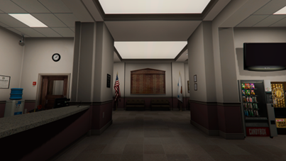
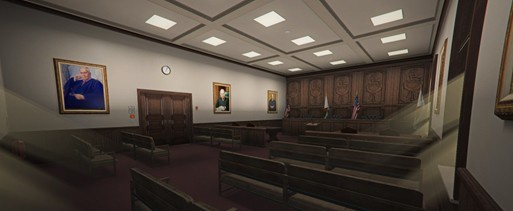

# Rechtbank

{ align=right }

De rechtbank is gevestigd in de City Hall te Paleto Bay. 
Het gebouw beschikt over één rechtszaal.
In de rechtbank worden alleen strafzittingen behandeld.
In de meeste gevallen is het mogelijk om een zitting bij te wonen. 
Bekijk hieronder de bezoekersinformatie voor het bijwonen van een rechtszaak. 

---

## Bezoekersinformatie
Bij grote belangstelling kan het voorkomen dat er geen plek meer is op de publieke tribune. 
Helaas kunt u de zitting dan niet bijwonen. Mocht u naar de rechtbank komen houd dan  
rekening met de volgende zaken:  
&ensp; &nbsp; &nbsp; &nbsp; • _Minimale leeftijd voor het bijwonen van een strafzitting is 16 jaar._  
&ensp; &nbsp; &nbsp; &nbsp; • _Neem altijd een geldig identiteitsbewijs of rijbewijs mee._     
&ensp; &nbsp; &nbsp; &nbsp; • _U kunt bij binnenkomst worden gefouilleerd._  
&ensp; &nbsp; &nbsp; &nbsp; • _Het dragen van gezichtsbedekkende kleding is verboden._  

### Werking strafzaak
Een strafzitting verloopt altijd via een vast patroon. Het is handig om te weten wat u kunt verwachten voordat u een zitting bijwoont. 
Daarom is de verloop van een strafzitting hieronder weergegeven:

&ensp; &nbsp; &nbsp; &nbsp; 1. __Controle persoonsgegevens + mededeling aanwezigen__  
&ensp; &nbsp; &nbsp; &nbsp; Rechter opent de zitting en neemt de persoonsgegevens van de verdachte door.   
&ensp; &nbsp; &nbsp; &nbsp; Vervolgens vertelt de rechter wie er nog meer in de rechtszaal aanwezig zijn   
&ensp; &nbsp; &nbsp; &nbsp; (getuigen, deskundigen, familie etc).      
&ensp; &nbsp; &nbsp; &nbsp; 2. __Mededeling cautie aan verdachte__  
&ensp; &nbsp; &nbsp; &nbsp; De rechter legt aan de verdachte uit dat hij ook tijdens de zitting niet tot  
&ensp; &nbsp; &nbsp; &nbsp; antwoorden verplicht is.     
&ensp; &nbsp; &nbsp; &nbsp; 3. __Tenlastelegging__  
&ensp; &nbsp; &nbsp; &nbsp; De district attorney leest de tenlastelegging voor. Hierin wordt vertelt voor welke  
&ensp; &nbsp; &nbsp; &nbsp; strafbare feiten de verdachte wordt aangeklaagd.        
&ensp; &nbsp; &nbsp; &nbsp; 4. __Onderzoek door rechter__  
&ensp; &nbsp; &nbsp; &nbsp; De rechter zal de verdachte verschillende vragen gaan stellen. Bij  
&ensp; &nbsp; &nbsp; &nbsp; aanwezigheid van getuigen, deskundige of familie krijgen zij de  
&ensp; &nbsp; &nbsp; &nbsp; mogelijkheid om te spreken.      
&ensp; &nbsp; &nbsp; &nbsp; 5. __Requisitoir + strafeis__  
&ensp; &nbsp; &nbsp; &nbsp; De district attorney zal zijn visie geven op de zaak. Dit wordt het requisitoir  
&ensp; &nbsp; &nbsp; &nbsp; genoemd. Na afloop van het requisitoir volgt altijd de strafeis.    
&ensp; &nbsp; &nbsp; &nbsp; 6. __Pleidooi advocaat__  
&ensp; &nbsp; &nbsp; &nbsp; Vervolgens is het woord aan de advocaat van de verdachte. De advocaat  
&ensp; &nbsp; &nbsp; &nbsp; voert de verdediging van de verdachte aan. Hierbij kan de advocaat  
&ensp; &nbsp; &nbsp; &nbsp; reageren op het requisitoir.     
&ensp; &nbsp; &nbsp; &nbsp; 7. __Reactie pleidooi__  
&ensp; &nbsp; &nbsp; &nbsp; Er vindt vervolgens een tweede ronde plaats. De district attorney mag reageren  
&ensp; &nbsp; &nbsp; &nbsp; op het pleidooi van de advocaat.    
&ensp; &nbsp; &nbsp; &nbsp; 8. __Reactie advocaat__  
&ensp; &nbsp; &nbsp; &nbsp; Vervolgens mag ook de advocaat van de verdachte hier weer op reageren.    
&ensp; &nbsp; &nbsp; &nbsp; 9. __Laatste woord verdachte__  
&ensp; &nbsp; &nbsp; &nbsp; Het laatste woord is altijd voor de verdachte. De verdachte kan hierin  
&ensp; &nbsp; &nbsp; &nbsp; spijt betuigen of zijn zienswijze op de zaak naar voren brengen.    
&ensp; &nbsp; &nbsp; &nbsp; 10. __Vonnis__  
&ensp; &nbsp; &nbsp; &nbsp; Als laatst sluit de rechter het onderzoek ter terechtzitting. Het kan zijn  
&ensp; &nbsp; &nbsp; &nbsp; dat een rechter direct uitspraak doet. In complexe zaken zou het vonnis op  
&ensp; &nbsp; &nbsp; &nbsp; een later moment worden uitgesproken.  

### Rechtszalen

De rechtbank beschikt over één rechtszaal.   

<figure markdown="span">
  { width="300" }
  <figcaption>Rechtszaal - Paleto Bay</figcaption>
</figure>
