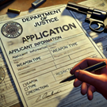

# Vergunningen

{ align=right }

Vergunningsaanvragen verlopen via het [Department of Justice](/Department%20of%20Justice/doj).
De Chief of Justice kan verschillende soorten vergunningen afgewegen. 
Vergunningen die onder andere door het Department of Justice worden afgegegeven zijn wapenvergunningen en bedrijfsvergunningen. 

### Wapenvergunning
