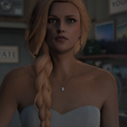
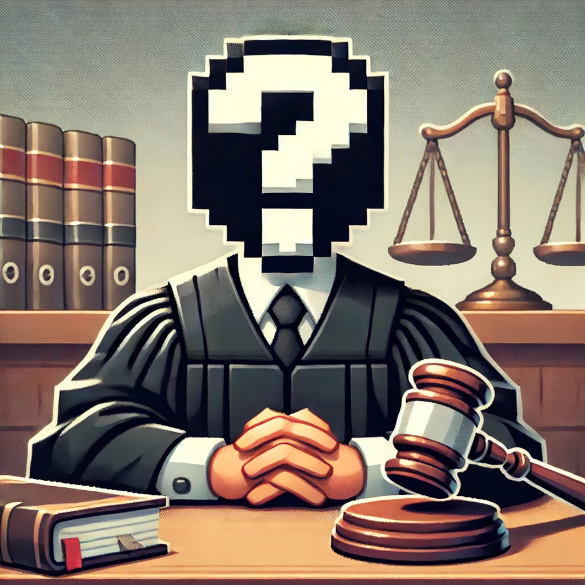

# Department of Justice

{ align=right }

Het Department of Justice, afgekort als DOJ, maakt deel uit van de wetgevende- en rechtsprekende macht.  
Kort gezegd kan het Department directe wijzigingen aanbrengen in wet- en regelgeving. Daarnaast benoemt 
het Department rechters die tijdens strafzaken verantwoordelijk zijn voor het handhaven 
van de rechtsorde, het beoordelen van bewijsmateriaal en het opleggen van passende straffen.

####Advocatuur
Het staat een ieder volledig vrij om advocaat te worden, behalve als je een strafblad hebt. Onder strafblad wordt verstaan dat je in de afgelopen 30 dagen bent veroordeeld voor een misdrijf. Houd daarnaast rekening met de volgende zaken:  
&ensp; &nbsp; &nbsp; &nbsp; • Als advocaat worden normale omgangsvormen verwacht. Hieronder valt 
                              ook het dragen van gepaste kleding die de professionaliteit van het 
                              beroep weerspiegelt.   
&ensp; &nbsp; &nbsp; &nbsp; • Voor binnenkomst op het politiebureau kan je worden gefouilleerd.        
&ensp; &nbsp; &nbsp; &nbsp; • De kosten van de advocaat zijn voor rekening van de verdachte.  

 

---

__De volgende personen maken op dit moment deel uit van het Department of Justice:__

-   __Chief of Justice__ : GEZOCHT

    ---

    { align=right }

    _De Chief of Justice dient als adviesorgaan voor _ 

-   __Rechter__ : GEZOCHT

    ---

    { align=right }

    _ _

-   __Rechter__ : GEZOCHT

    ---

    { align=right }

    _ _

-   __Rechter__ : GEZOCHT

    ---

    { align=right }

    _ _

-   __Rechter__ : GEZOCHT

    ---

    { align=right }

    _ _

