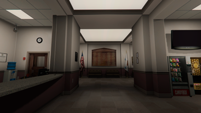
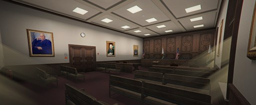

# Rechtbank

{ align=right }

De rechtbank is gevestigd in de City Hall te Paleto Bay. 
Het gebouw beschikt over één rechtszaal.
In de meeste gevallen is het mogelijk om een zitting bij te wonen. 
Bekijk hieronder de bezoekersinformatie voor het bijwonen van een rechtszaak. 

## Bezoekersinformatie
Bij grote belangstelling kan het voorkomen dat er geen plek meer is op de publieke tribune. 
Helaas kunt u de zitting dan niet bijwonen.

__Overige informatie__  
&ensp; &nbsp; &nbsp; &nbsp; • _Minimale leeftijd 18 jaar._  
&ensp; &nbsp; &nbsp; &nbsp; • _Neem altijd een geldig identiteitsbewijs of rijbewijs mee._     
&ensp; &nbsp; &nbsp; &nbsp; • _U kunt bij binnenkomst worden gefouilleerd._  

### Werking strafzaak
Een strafzitting verloopt altijd via een vast patroon. Het is handig om te weten wat u kunt verwachten voordat u een zitting bijwoont. 
Daarom is de verloop van een strafzitting hieronder weergegeven:

&ensp; &nbsp; &nbsp; &nbsp; 1. __Controle persoonsgegevens + mededeling aanwezigen__  
&ensp; &nbsp; &nbsp; &nbsp; &nbsp; &nbsp; Rechter opent de zitting en neemt de persoonsgegevens van de verdachte door.   
&ensp; &nbsp; &nbsp; &nbsp; &nbsp; &nbsp; Vervolgens vertelt de rechter wie er nog meer in de rechtszaal aanwezig zijn   
&ensp; &nbsp; &nbsp; &nbsp; &nbsp; &nbsp; (getuigen, familie etc).    
&ensp; &nbsp; &nbsp; &nbsp; 2. __Mededeling cautie aan verdachte__  
&ensp; &nbsp; &nbsp; &nbsp; &nbsp; &nbsp; De rechter legt aan de verdachte uit dat hij ook tijdens de zitting niet tot  
&ensp; &nbsp; &nbsp; &nbsp; &nbsp; &nbsp; antwoorden verplicht is.   
&ensp; &nbsp; &nbsp; &nbsp; 3. __Tenlastelegging__  
&ensp; &nbsp; &nbsp; &nbsp; &nbsp; &nbsp; De [FUNCTIE] leest de tenlastelegging voor. Hierin wordt vertelt voor welke  
&ensp; &nbsp; &nbsp; &nbsp; &nbsp; &nbsp; strafbare feiten de verdachte wordt aangeklaagd.
&ensp; &nbsp; &nbsp; &nbsp; 4. __Onderzoek door rechter__  
&ensp; &nbsp; &nbsp; &nbsp; 5. __Requisitoir + strafeis__  
&ensp; &nbsp; &nbsp; &nbsp; 6. __Pleidooi advocaat__  
&ensp; &nbsp; &nbsp; &nbsp; 7. __Reactie pleidooi__  
&ensp; &nbsp; &nbsp; &nbsp; 8. __Reactie advocaat__  
&ensp; &nbsp; &nbsp; &nbsp; 9. __Laatste woord verdachte__  
&ensp; &nbsp; &nbsp; &nbsp; 10. __Vonnis__  

### Rechtszalen

Rechtbank Roxwood beschikt over één rechtszaal. 
Hieronder is een illustratie van deze rechtszaal weergegeven.
 
 

<figure markdown="span">
  { width="500" }
  <figcaption>Rechtszaal - Paleto Bay</figcaption>
</figure>
